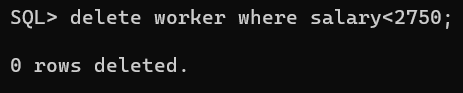

# EX 2 Data Manipulation Language (DML) Commands and built in functions in SQL

## DATE: 10/08/2023


## AIM:
To create a manager database and execute DML queries using SQL.


## DML(Data Manipulation Language)
<div align="justify">
The SQL commands that deal with the manipulation of data present in the database belong to DML or Data Manipulation Language and this includes most of the SQL statements. It is the component of the SQL statement that controls access to data and to the database. Basically, DCL statements are grouped with DML statements.
</div>

## List of DML commands: 
<div align="justify">
INSERT: It is used to insert data into a table.<br>
UPDATE: It is used to update existing data within a table.<br>
DELETE: It is used to delete records from a database table.<br>
</div>

## Create the table as given below:
```sql
create table manager(enumber number(6),ename char(15),salary number(5),commission number(4),annualsalary number(7),Hiredate date,designation char(10),deptno number(2),reporting char(10));
```
## insert the following values into the table
```sql
insert into manager values(7369,'Dharsan',2500,500,30000,'30-June-81','clerk',10,'John');
insert into manager values(7839,'Subu',3000,400,36000,'1-Jul-82','manager',null,'James');
insert into manager values(7934,'Aadhi',3500,300,42000,'1-May-82','manager',30,NULL);
insert into manager values(7788,'Vikash',4000,0,48000,'12-Aug-82','clerk',50,'Bond');
```

### Q1) Update all the records of manager table by increasing 10% of their salary as bonus.

### QUERY:


### OUTPUT:

### Q2) Delete the records from manager table where the salary less than 2750.


### QUERY:


### OUTPUT:

### Q3) Display each name of the employee as “Name” and annual salary as “Annual Salary” (Note: Salary in emp table is the monthly salary)


### QUERY:


### OUTPUT:

### Q5)	List the names of Clerks from emp table.


### QUERY:


### OUTPUT:


### Q6)	List the names of employee who are not Managers.


### QUERY:


### OUTPUT:


### Q7)	List the names of employees not eligible for commission.


### QUERY:


### OUTPUT:


### Q8)	List employees whose name either start or end with ‘s’.


### QUERY:


### OUTPUT:


### Q9) Sort emp table in ascending order by hire-date and list ename, job, deptno and hire-date.


### QUERY:


### OUTPUT:


### Q10) List the Details of Employees who have joined before 30 Sept 81.


### QUERY:


### OUTPUT:


### Q11)	List ename, deptno and sal after sorting emp table in ascending order by deptno and then descending order by sal.


### QUERY:


### OUTPUT:


### Q12) List the names of employees not belonging to dept no 30,40 & 10


### QUERY:


### OUTPUT:

### Q13) Find number of rows in the table EMP

### QUERY:


### OUTPUT:


### Q14) Find maximum, minimum and average salary in EMP table.

### QUERY:


### OUTPUT:


### Q15) List the jobs and number of employees in each job. The result should be in the descending order of the number of employees.

### QUERY:


### OUTPUT:


## RESULT:
Thus,the data manipulation language and data control language commands are executed.

